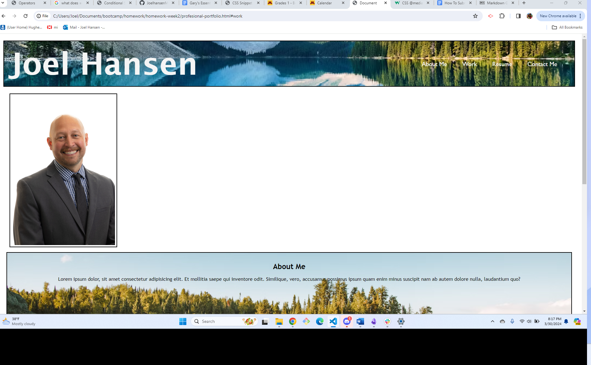

# Professional Portfolio Creation Project

## Description 
For this project we were asked to build a professional porfolio page that could be provided to potential employers. For this project I created a webpage that consists of 4 sections (about me, my work, my resume, and contact information) with links to them placed inside the navigation bar.  I also created CSS page linked to it for styling purposes which included insertion of background images representative of my intersts along with a professional headshot.  

## ScreenShot of application

## link to web application
[click here](https://joelhansenmn.github.io/professional_portfolio/)

## link to github repo 
[click here](https://github.com/JoelhansenMN/professional_portfolio/tree/master)

